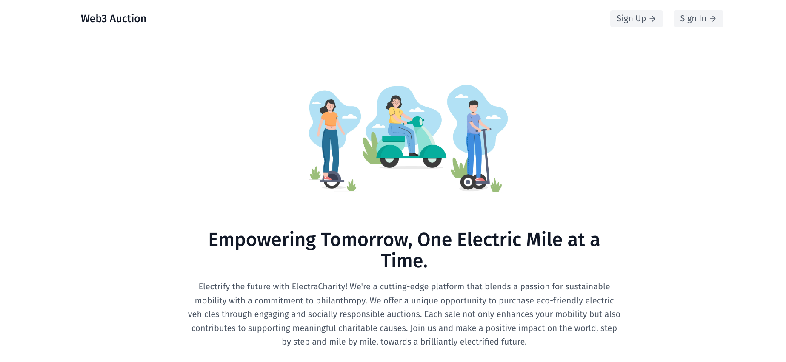
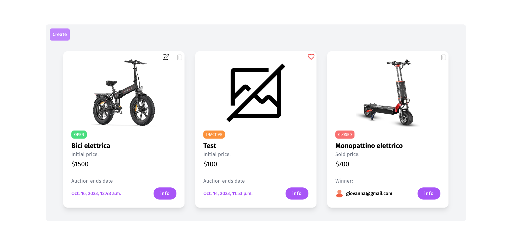
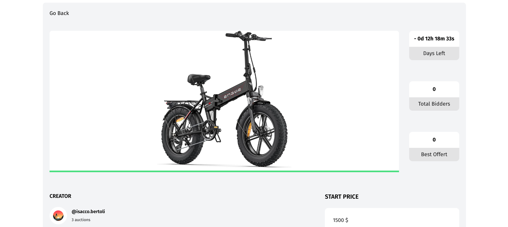
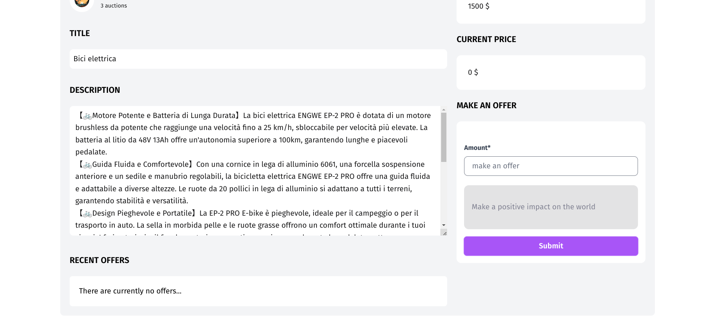
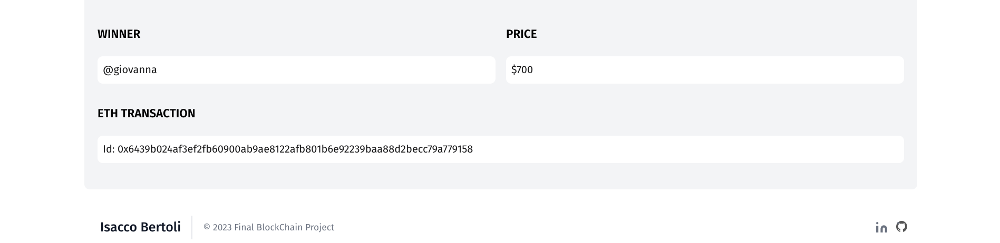
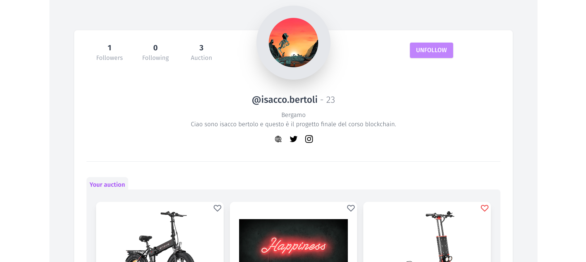
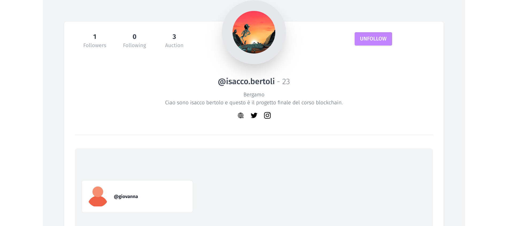
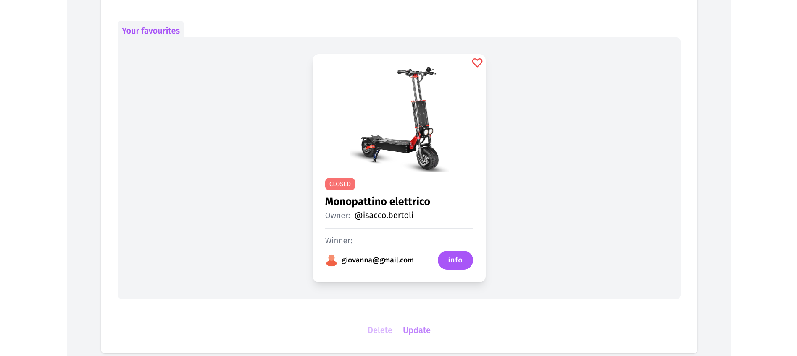
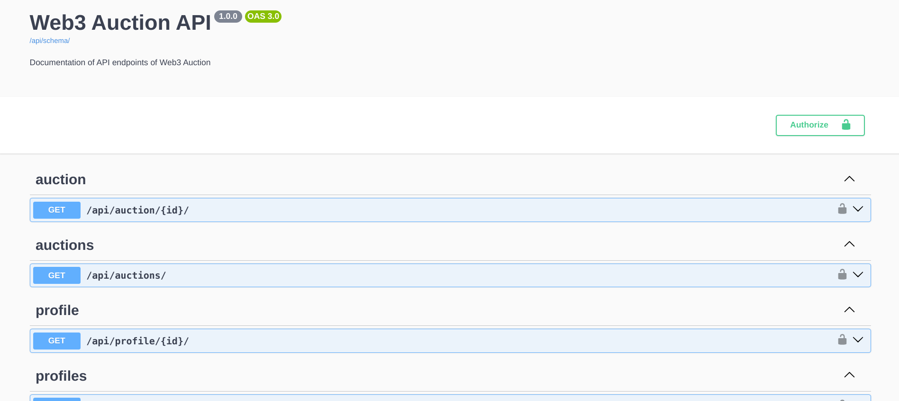

# Final Start2Impact BlockChain Project

- A platform to manage the sale of electric vehicles through a charity auction for a micromobility company.
- License: MIT

how does it work?
Any registered user can create an auction and bid on other active auctions. Once the time expires, if there are bids, the auction is closed and a transaction is sent to the Sepolia testnet containing the details of the auction. If there are no bids when the time runs out, the auction is marked as inactive and the owner can edit and publish it again or delete it.
<br>
The application also includes a follower and favorites management system

## Demo

Link: https://demo6.isaccobertoli.com


## Tech Stack

**Client:** TailwindCSS, javascript.

**Server:** django, rest framework, clery.

**Database:** postgres, redis.

## Screenshots

- Home

<p align="center">
    
</p>

- Auction List

<p align="center">
    
</p>

- Auction Detail

<p align="center">
    
    
</p>

- ETH Transaction

<p align="center">
    
</p>

- Profile

<p align="center">
    
</p>

- Profile Follow

<p align="center">
    
</p>

- Profile Favourite

<p align="center">
    
</p>

- API Page

<p align="center">
    
</p>

## Getting Up and Running Locally


### Clone Repo

```bash
git@github.com:Isacco-B/Web3Auction_Start2Impact.git
```


### Create .env File

```bash
DATABASE_URL=postgres://postgres:<password>@127.0.0.1:5432/<db_name>
CELERY_BROKER_URL=redis://localhost:6379/0

WALLET_ADDRESS=0x00000000000000000000000000000000000000000
PRIVATE_KEY=0000000000000000000000000000000000000000000000000
PROVIDER=https://eth-sepolia.g.alchemy.com/v2/<api_key>
```


### Create virtual_env

```bash
python3.11 -m venv venv
source venv/bin/activate
export DJANGO_READ_DOT_ENV_FILE=True
```


### Create postgresdb

```bash
createdb --username=postgres <project_slug>
```


### Makemigrations / Migrate

```bash
python manage.py makemigrations
python manage.py migrate
```


### Setting Up Your Users

- To create a **normal user account**, just go to Sign Up and fill out the form. Once you submit it, you'll see a "Verify Your E-mail Address" page. Go to your console to see a simulated email verification message. Copy the link into your browser. Now the user's email should be verified and ready to go.

- To create a **superuser account**, use this command:

      $ python manage.py createsuperuser

For convenience, you can keep your normal user logged in on Chrome and your superuser logged in on Firefox (or similar), so that you can see how the site behaves for both kinds of users.


### Runserver

```bash
python manage.py runserver
```


### Celery

This app comes with Celery.

To run a celery worker:

```bash
cd web3_auction
celery -A config.celery_app worker -l info
```

Please note: For Celery's import magic to work, it is important _where_ the celery commands are run. If you are in the same folder with _manage.py_, you should be right.

To run [periodic tasks](https://docs.celeryq.dev/en/stable/userguide/periodic-tasks.html), you'll need to start the celery beat scheduler service. You can start it as a standalone process:

```bash
cd web3_auction
celery -A config.celery_app beat
```

or you can embed the beat service inside a worker with the `-B` option (not recommended for production use):

```bash
cd web3_auction
celery -A config.celery_app worker -B -l info
```

## 🔗 Links
[](https://www.linkedin.com/in/isacco-bertoli-10aa16252/)
